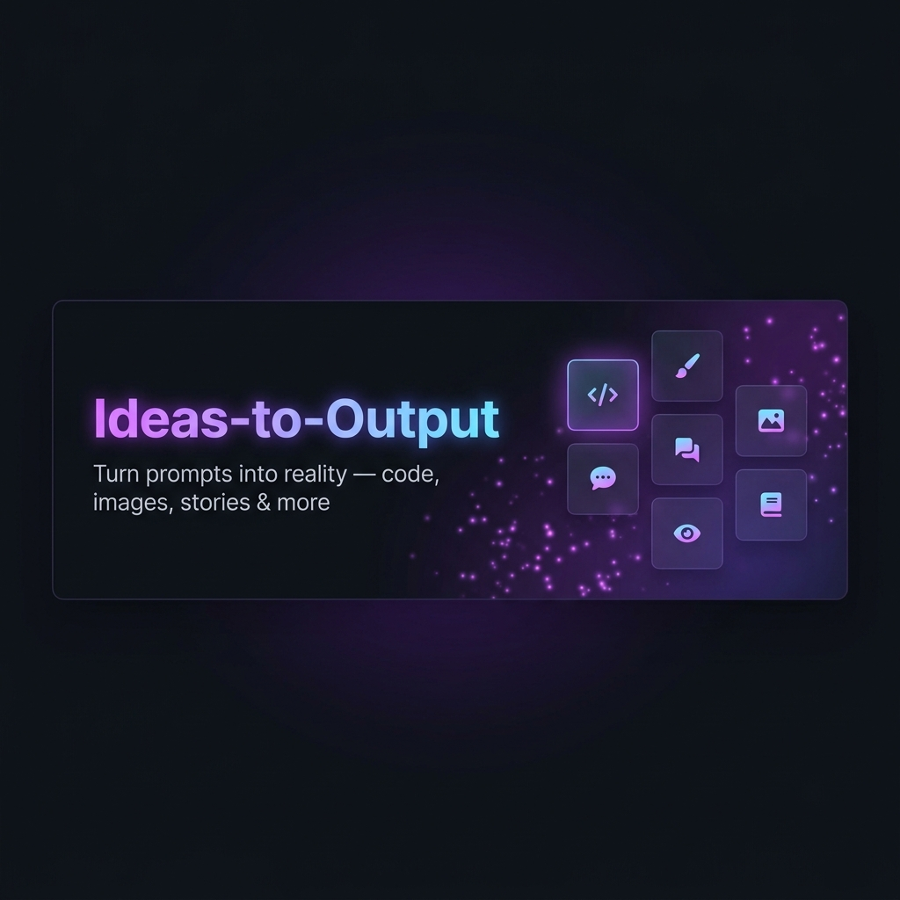

<div align="center">
  
</div>

<br/>

<div align="center">

# ✨ Ideas-to-Output

**One platform. Every AI superpower you need.**
Turn any idea into code, images, stories, summaries, and more—in seconds.

<br/>

[](https://nextjs.org/)
[](https://react.dev/)
[](https://tailwindcss.com/)
[](https://clerk.com/)
[](https://convex.dev/)
[](https://groq.com/)

<br/>

[](https://opensource.org/licenses/MIT)
[](http://makeapullrequest.com)


</div>

---

## 📖 What is Your-Prompts?

> **Your-Prompts** is a full-stack AI productivity platform that removes the fragmentation of modern AI tools. Instead of juggling between ChatGPT, DALL·E, a code editor, and a PDF summarizer — it's **all here**, in one clean interface.

You type a prompt. The AI delivers — whether it's a working code block, an original image, an immersive story, or a crisp summary of a long document.

---

## 🚀 Feature Showcase

| Feature | What it does | AI Behind It |
|---|---|---|
| 💻 **Code Generator** | Generate production-ready code from a plain description | Groq · `llama-3.1-8b-instant` |
| 🖼️ **Image Creator** | Describe any scene — get a stunning image back | Pollinations AI (free, no key needed) |
| 🔍 **Image to Text** | Upload a photo and ask questions about it | Groq · `llama-4-scout-17b` (Vision) |
| ✂️ **Background Remover** | Strip image backgrounds with one click | Hugging Face Space (Gradio) |
| 📖 **Story Writer** | Generate imaginative, long-form stories from a prompt | Groq · `llama-3.1-8b-instant` |
| 📝 **Smart Summarizer** | Paste any article or text — get a clean summary | Groq · `llama-3.3-70b-versatile` |
| 💬 **AI Dialogue** | Chat with a fast, context-aware AI assistant | Groq · `llama-3.1-8b-instant` |

---

## 🛠️ Tech Stack

<table>
  <tr>
    <td><strong>🖥️ Frontend</strong></td>
    <td>Next.js 15 (App Router), React 19, Tailwind CSS 4, Framer Motion, Lucide Icons</td>
  </tr>
  <tr>
    <td><strong>🔐 Authentication</strong></td>
    <td>Clerk — Google OAuth, Email/Password, Session management</td>
  </tr>
  <tr>
    <td><strong>🗄️ Database</strong></td>
    <td>Convex — Real-time reactive backend, stores user history</td>
  </tr>
  <tr>
    <td><strong>🤖 AI & ML</strong></td>
    <td>Groq (LLM), Pollinations AI (images), Hugging Face Spaces (BG removal)</td>
  </tr>
  <tr>
    <td><strong>📦 Deployment</strong></td>
    <td>Vercel (Next.js), Convex Cloud</td>
  </tr>
</table>

---

## 🏗️ Architecture Overview

```
User Browser
    │
    ▼
┌─────────────────────────────────────────┐
│           Next.js 15 App Router          │
│                                          │
│   /code  /image  /story  /summary  ...  │
│                                          │
│   ┌──────────────────────────────────┐  │
│   │   Clerk Authentication           │  │
│   │   (protects all /overview routes)│  │
│   └──────────────────────────────────┘  │
│                                          │
│   ┌──────────────────────────────────┐  │
│   │   /app/api/* (Server Functions)  │  │
│   │   ┌──────────────────────────┐   │  │
│   │   │  /api/code   → Groq LLM  │   │  │
│   │   │  /api/image  → Pollinations   │  │
│   │   │  /api/image-to-text → Groq   │  │
│   │   │  /api/story  → Groq LLM  │   │  │
│   │   │  /api/summary → Groq LLM │   │  │
│   │   │  /api/dialogue → Groq LLM│   │  │
│   │   │  /api/remove-background  │   │  │
│   │   │           → HF Gradio   │   │  │
│   │   └──────────────────────────┘   │  │
│   └──────────────────────────────────┘  │
│                                          │
│   ┌──────────────────────────────────┐  │
│   │      Convex (Real-time DB)       │  │
│   │   Stores users + tool history    │  │
│   └──────────────────────────────────┘  │
└─────────────────────────────────────────┘
```

**Key Design Decisions:**
- 🔒 All API keys live **only on the server** — never exposed to the client
- ⚡ Groq was chosen over OpenAI for its **10x faster inference** speeds
- 🔄 Convex provides reactive state — no manual `fetch` polling needed
- 🧱 Separate route per tool ensures each feature is independently scalable

---

## ⚡ Quick Start

### Prerequisites

Make sure you have the following ready:

- ✅ Node.js `v18+`
- ✅ A [Groq API Key](https://console.groq.com/) — free tier available
- ✅ A [Clerk account](https://clerk.com/) — free tier available
- ✅ A [Convex account](https://dashboard.convex.dev/) — free tier available

---

### 1️⃣ Clone & Install

```bash
git clone https://github.com/Shubham37204/Ideas-to-Output.git
cd Ideas-to-Output
npm install
```

### 2️⃣ Configure Environment Variables

Create a `.env.local` file at the root:

```env
# ─── Clerk (Authentication) ─────────────────────────────────────
NEXT_PUBLIC_CLERK_PUBLISHABLE_KEY=pk_test_...
CLERK_SECRET_KEY=sk_test_...

# ─── Clerk Redirect URLs ─────────────────────────────────────────
NEXT_PUBLIC_CLERK_SIGN_IN_URL=/sign-in
NEXT_PUBLIC_CLERK_AFTER_SIGN_IN_URL=/overview

# ─── Convex (Database) ───────────────────────────────────────────
NEXT_PUBLIC_CONVEX_URL=https://your-url.convex.cloud

# ─── Groq (AI Engine) ────────────────────────────────────────────
GROQ_API_KEY=gsk_...
```

### 3️⃣ Launch Dev Server

```bash
npm run dev
```

🌐 Open [http://localhost:3000](http://localhost:3000) — you're live!

---

## 📂 Project Structure

```
prompt-to-things/
├── 📁 app/
│   ├── 📁 api/                  # Serverless AI endpoints
│   │   ├── code/route.js        # Code generation
│   │   ├── dialogue/route.js    # Chatbot
│   │   ├── image/route.js       # Image generation
│   │   ├── image-to-text/       # Vision AI
│   │   ├── remove-background/   # BG Removal via Gradio
│   │   ├── story/route.js       # Story generator
│   │   └── summary/route.js     # Text summarizer
│   ├── 📁 code/                 # Code tool UI
│   ├── 📁 image/                # Image tool UI
│   ├── 📁 story/                # Story tool UI
│   ├── 📁 summary/              # Summarizer tool UI
│   ├── 📁 dialogue/             # Chat tool UI
│   ├── 📁 remove-background/    # BG removal UI
│   ├── 📁 shared/               # Shared components (Navbar, Footer)
│   ├── 📁 overview/             # Tool dashboard (protected)
│   ├── layout.jsx               # Root layout + Providers
│   └── page.jsx                 # Landing page
├── 📁 convex/                   # Database schema & mutations
├── 📁 public/                   # Static assets
├── middleware.js                # Clerk route protection
└── next.config.mjs
```

---

## 🧠 AI Models Reference

| Route | Model | Provider | Notes |
|---|---|---|---|
| `/api/code` | `llama-3.1-8b-instant` | Groq | Fast, efficient code gen |
| `/api/dialogue` | `llama-3.1-8b-instant` | Groq | Real-time chatbot |
| `/api/image` | *(Dynamic)* | Pollinations AI | Free, no API key |
| `/api/image-to-text` | `llama-4-scout-17b-16e-instruct` | Groq | Multimodal vision model |
| `/api/remove-background` | *(Gradio Space)* | Hugging Face | `not-lain/background-removal` |
| `/api/story` | `llama-3.1-8b-instant` | Groq | With hardcoded fallback |
| `/api/summary` | `llama-3.3-70b-versatile` | Groq | 70B for quality summaries |

---

## 🤝 Contributing

Contributions are always welcome! Here's how to add a new AI tool:

1. **Fork** the repository
2. Create a new **page route**: `app/your-tool/page.jsx`
3. Create an **API route**: `app/api/your-tool/route.js`
4. Add your tool card to the **overview dashboard**
5. Submit a **Pull Request** 🎉

---

## 📜 License

This project is licensed under the **MIT License** — free to use, modify, and distribute.

---

<div align="center">

**Made with ❤️ and powered by the fastest AI models on the planet.**

⭐ Star this repo if you found it useful!

</div>
